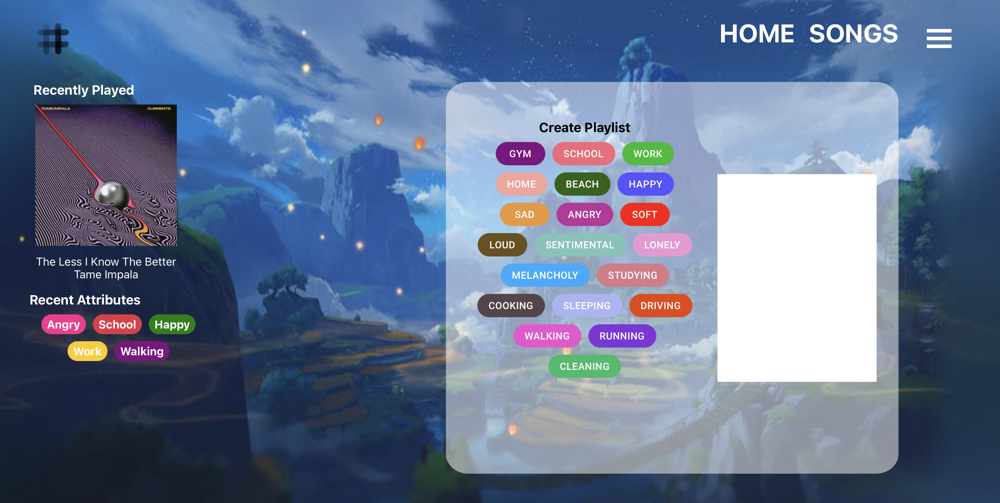
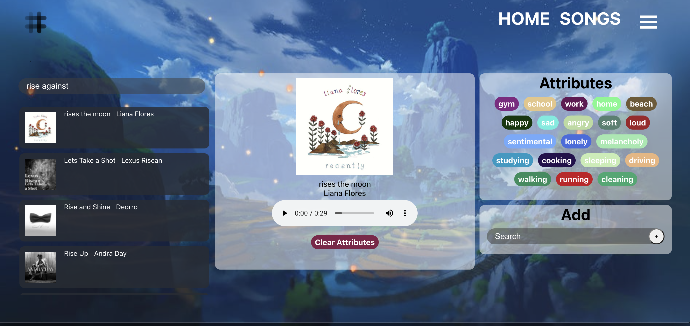

# LOST
 
## Description 
LOST – short for Life OST (Original Sound Track) - is a website that will use algorithms to play the perfect songs for each unique user based on time, location, activity, and even customizable filters. It will allow users to attach any song they listen to a customizable value which will be used to create ‘the perfect playlist’. Pre-defined values will range from locations, emotions, memories, time, and activities, and will also allow users to define their own. LOST will then use this data of the user and other users to create new playlists. These playlists will be a mix of familiar and new songs to give the listener a sense of familiarity while also introducing new songs and artists. After an initial collection of data, the user will have allowed the software to become aware of their music taste and suggest the perfect songs with just one click of a button.  

## Technicalities 

Framework: `Django REST Framework `

Languages: `Python` `React.js` `HTML` `CSS`

Design: `Figma` `Material-UI`

Database: `SQLite`

API: `Spotify` 

## Functionalities
### Current Features
`Login Page`

- Create a LOST account by authorizing Spotify

`Home Page`

- Displays current users most recently played song 
- Generate a playlist by clicking on an attribute 
  - Playlist will be created in Spotify and named after the selected attribute 
  - All songs assigned by current user with that attribute will be added to the playlist
  
  NOTE: Playlist will only display song names if 10 songs are assigned to that attribute. 
  If more than 10 songs are assigned to that attribute, the first 10 songs added will be displayed 
  
`Song Page`
- Search for songs on Spotify
- Assign location, mood, and activity attributes to a song 

  NOTE: Can only assign one of each attribute category 
   - Database entry is created for each song a user selects 
   - Attributes will be added/updated to the database
- Create and assign up to 3 custom attributes for each song

### Desired 
- Create algorithmn to generate songs based off user's history 
- Display songs attributes when searching 
- Search for playlists by attributes
- Allow more attributes to be selected for songs 

## Contributors 
- Kylie Lee 
- Cristina Powers
- Anthony Jones
- Kelly Whitlock
- Masrur Tajwar

## Navigation
### `LOST`- Our main project folder/settings 
* `__init__.py` - Makes LOST a python package 
* `asgi.py` - ASGI config for LOST project.
* `settings.py` - LOST project settings and installed apps
* `urls.py` - URLs for our main project 
*  `wsgi.py` - WSGI config for LOST project
### `api` - Django API application folder 
* `__init__.py` - Makes API a python package 
* `admin.py`
* `apps.py`
* `models.py` - Where API database models go 
* `serializers.py`
* `tests.py` - Used to test views or models 
* `urls.py` - API urls 
* `views.py` - Code responsible for rendering our API endpoints
### `frontend`- React & Frontend folder
* `migrations`
* `src` 
* `components` folder holds all React page components 
* `static` folder holds anything the browser would cache 
  * `css`
    * `index.css` 
  *  `frontend` - Stores the main javascript bundle
* `templates/frontend` 
* `Babel.config.json` - Reroutes the pages so you can go to different pages from the React app 
* `webpack.config.js` - Bundles all of our Javascript files into one file 
### `spotify`- Django Spotify folder for Spotify API calls
## Mockup
